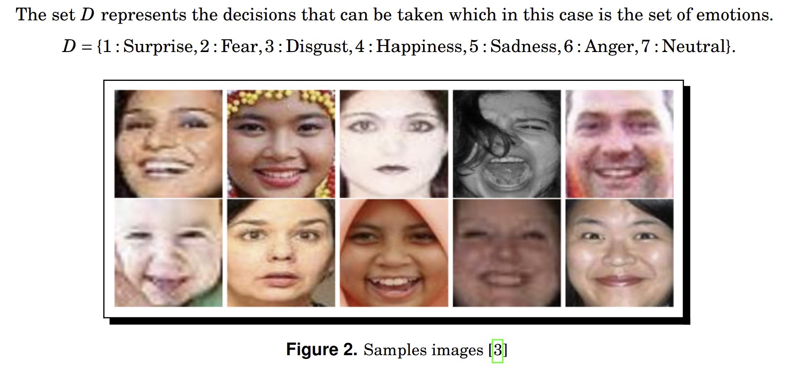
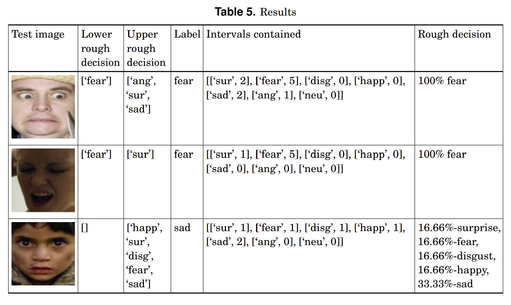

# Rough Decision Making for Facial Expression Detection

## Overview
This project introduces a **Rough Decision Making Framework** for handling uncertainty in decision-making problems. Leveraging **interval-valued fuzzy sets**, the framework classifies facial expressions using the **Real-world Affective Faces Database (RAF-DB)**. The model incorporates **upper and lower rough decisions** to manage imprecise information.

---

## Features
- **Novel Framework**: Extends rough set theory with fuzzy intervals for decision-making.
- **Facial Expression Detection**: Classifies seven emotions using geometric features from facial landmarks.
- **Dataset**: RAF-DB with approximately 30,000 diverse facial images.
- **Results**: Precise classifications with robust handling of uncertainty.

---

## Definitions
1. **Interval-Valued Fuzzy Information System**:
   - A knowledge-based system with fuzzy attribute intervals.
   - Attributes: Geometric parameters (e.g., distance between eyebrow center and nose tip).
   - Decisions: Classification into seven emotions (Surprise, Fear, Disgust, Happiness, Sadness, Anger, Neutral).

2. **Rough Decision**:
   - **Lower Rough Decision**: Strict inclusion of fuzzy intervals for classification.
   - **Upper Rough Decision**: Loose inclusion, allowing partial matches.

3. **Facial Parameters**:
   - Areas between facial landmarks (e.g., eye and eyebrow, eyelids).
   - Distances (e.g., eyebrow center to nose tip).

---

## Methodology
1. **Preprocessing**:
   - Align facial images based on 37 annotated landmark points.
   - Extract geometric parameters from landmark coordinates.

2. **Rough Decision Model**:
   - Classify emotions using interval-valued fuzzy sets.
   - Generate rough decisions based on confidence intervals.

3. **Outputs**:
   - Confidence intervals for each emotion derived from facial parameters.

---

## Dataset
- **Source**: RAF-DB (Real-world Affective Faces Database).
- **Features**:
  - 37 facial landmarks.
  - Classifications for seven emotions.
  - Image diversity in age, pose, and lighting.

---

## Results
- **Lower and Upper Rough Decisions**: Provides nuanced classifications.
- **Accuracy**: Enhanced performance in uncertain conditions.

### Sample Images with Parameters

### Results with Proposed Model

---

## References
- **Publication**: "Rough Decision Making of Facial Expression Detection" by B. Praba, P. Charumathi, and Bhavana Anand.
- **DOI**: [10.26713/cma.v15i1.2598](http://doi.org/10.26713/cma.v15i1.2598)
